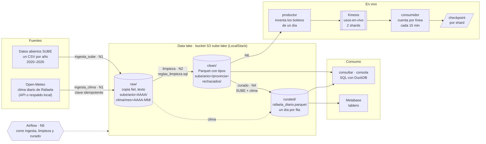

# Clase 2 — Del CSV al data lake

Introducción a *data engineering*, y antesala directa del curso de AWS Academy Data
Engineering.

Vamos a armar, de punta a punta, un pipeline de datos con datos abiertos reales: desde
un CSV público hasta un tablero, pasando por un data lake. Como en la clase 1, van a
trabajar ustedes y varias veces les voy a pedir que hagan algo "mal" a propósito.

**No hace falta cuenta de AWS ni tarjeta de crédito.** Todo corre en su máquina.

## Lo que vamos a armar

Del CSV del Ministerio a un tablero, pasando por las tres zonas de un data lake. Cada
flecha dice en qué nivel de la clase la construimos.



## Qué preparar EN CASA, antes de venir

Es ancho de banda, no es tarea: unos 3 GB de imágenes y 380 MB de datos. Bajarlo todos
juntos desde el campus nos come media clase.

**1. Verifiquen que Docker funciona**

```bash
docker --version
docker compose version
```

**2. Bajen las imágenes**

```bash
docker pull localstack/localstack:3
docker pull apache/airflow:2.9.2
docker pull python:3.11-slim
```

La de `localstack` quizás ya la tengan de la clase 1.

**3. Bajen los datos**

Son los datos abiertos de SUBE (un archivo por año, 2020 a 2026). Desde esta carpeta:

- **Linux / macOS / Git Bash:** `./descargar_datos.sh`
- **Windows (PowerShell):** `powershell -ExecutionPolicy Bypass -File descargar_datos.ps1`

Quedan en `clase2-datos/`. Si se corta, vuelvan a correrlo: saltea lo que ya bajó.

## Requisitos de la máquina

- **8 GB de RAM** alcanzan (lo que levantamos usa unos 2 GB). Si la suya no llega,
  trabajamos de a dos.
- Unos **5 GB de disco** libres.
- Si usan **Docker Desktop** en Windows o Mac, ábranlo antes de salir de casa y
  esperen a que diga *running*.

## El día de la clase

Les doy la clave, descomprimen `clase-2.zip` acá mismo (queda una carpeta `clase-2/`
al lado de `clase2-datos/`) y arrancamos. Adentro está el `EJERCICIOS.md` con todo lo
que vamos a hacer.
